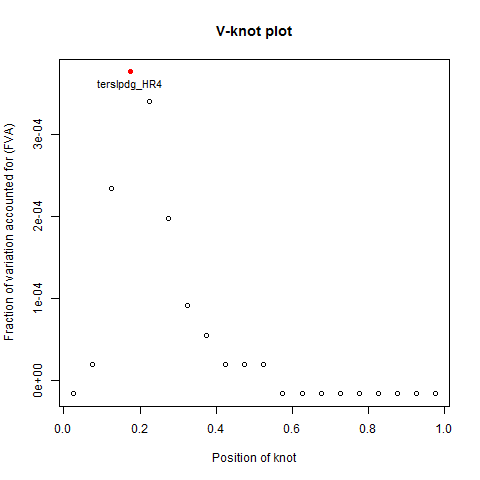

```{r, echo = FALSE}
knitr::opts_chunk$set(collapse = TRUE, comment = "#>")
```

This short vignette is meant to introduce users to the `MIAmaxent` package by providing a worked example of a distribution modeling exercise. It shows how to use all of the main functions included in `MIAmaxent` in the order of a typical analysis. This vignette does NOT describe the theoretical underpinnings of the package. To learn more about the theory behind `MIAmaxent`, the user is referred to Halvorsen (2013)[^1] and Halvorsen et al. (2015)[^2], as well as other references listed in the documentation of the package. 

>__Help pages for the package and for individual functions in the package can be accessed in R using the help command: `?('MIAmaxent')`.__ 


## Data set

The data used for demonstration in this vignette are a set of data that have been used to model the distribution of semi-natural grasslands in Østfold County, in southeastern Norway. The data set consists of 1059 locations where presence of semi-natural grasslands has been recorded, 13 environmental variables covering the extent of the study area, and 122 locations where the presence or absence of semi-natural grasslands has been recorded, independently of the presence-only records. The extent of the study area is about 4000 square kilometers, and grain of the raster data is 500 meters (0.25 km^2^).

>__The data used in this vignette are included in the package as an example data set, so the code and results shown here can be directly replicated.__  

Before beginning the modeling exercise, it may be useful to see what the data look like in their geographical representation. We can use the `raster` package to plot the 1059 recorded presences on top of one of the environmental variable rasters:
```{r, fig.show='hold', fig.width=5, fig.height=5, warning=FALSE, message =FALSE, results='hide', fig.cap="Presence-only occurrence across the study area"}
library(raster)
EV1 <- raster(list.files(system.file("extdata", "EV_continuous", package = "maxentmodelselectr"), full.names = TRUE)[1])
PO <- read.csv(system.file("extdata", "occurrence_PO.csv", package = "maxentmodelselectr"))

par(mar=c(3.1,3.1,2.1,0.1))
plot(EV1, colNA = 'black', legend=FALSE)
points(PO$POINT_X, PO$POINT_Y, pch = 20, cex = 0.5, col = 'blue')
par(mar=c(5.1,4.1,4.1,2.1))
```

##### readData(...)

The starting point for modeling using `MIAmaxent` is a simple data object that contains occurrence data for the modeled target as well as all of the environmental data. The format of this data object is a data frame with the response variable of the model (occurrence) in the first column, and explanatory variables of the model (environmental variables) in subsequent columns. In generative maxent modeling, the response variable (RV) is binary, and can be either presence or unknown background. These values are coded as "1" and "NA" respectively in the data object. Explanatory variables (EVs) may be continuous or categorical, and these types are denoted by numeric class and factor class respectively. 

>__The `readData(...)` function transforms data in CSV and ASCII raster file formats into a single data frame which serves as the starting point for modeling.__  

Users of the maxent.jar program are usually accustomed to having their training data in an a different format. Specifically, occurrence data is often in CSV file format, with presences records followed by coordinates, and environmental data in ASCII raster file format. The `readData` function makes it easy to convert these data formats into the data object that is used in `MIAmaxent`. This function extracts values of the environmental variables at presence locations and at a set of randomly selected background locations, and properly formats these into the starting point for modeling. Alternatively, the user can also specify a custom set of background locations by giving these in the CSV file. 

We begin by creating our data object from file. Note that continuous and categorical environmental variables should be placed in separate directories:
```{r}
library(maxentmodelselectr)
grasslandPO <-readData(occurrence = system.file("extdata", "occurrence_PO.csv", package = "maxentmodelselectr"), 
                  contEV = system.file("extdata", "EV_continuous", package = "maxentmodelselectr"),
                  catEV = system.file("extdata", "EV_categorical", package = "maxentmodelselectr"),
                  maxbkg = 20000)

```

>__All functions in `MIAmaxent` produce console output. Therefore it's handy to always assign function output to an object, so that you can manipulate that object further.__  

If we look at the resulting data object we see the response variable (with `r sum(grasslandPO$RV == 1, na.rm = TRUE)` presence and `r sum(is.na(grasslandPO$RV))` background points) along with `r sum(sapply(grasslandPO[,-1], class) == "numeric")` continuous and `r sum(sapply(grasslandPO[,-1], class) == "factor")` categorical explanatory variables:
```{r}
str(grasslandPO)
sum(grasslandPO$RV == 1, na.rm = TRUE)
sum(is.na(grasslandPO$RV))
```

_IMPORTANT: Important considerations for distribution modeling, such as accounting for sampling bias and setting study area extent, are not dealt with in `MIAmaxent`, and must be dealt with beforehand. Good modeling practice requires that these issues be attended to!_


## Occurrence-environment relationships

By its simplist definition, a distribution model examines the relationship between the modeled target and its environment. In this way, distribution modeling follows the long tradition of gradient analysis in ecology[^1]. Therefore, before building an actual model, we should have some idea about what influence the environmental variables have on the occurence of the target.

##### plotFOP(...)

We can use the `plotFOP` function to create a so-called Frequency of Observed Presence (FOP) plot. An FOP plot shows how commonly the target occurs across the range of the explanatory variable, and makes it possible to recognize patterns in frequency of occurrence. Most often, the relationship between an environmental variable and modeled target is linear or unimodal, but the pattern seen in the FOP plot depends on the range of the EV, which in turn depends on the extent of the study area.

Here we examine FOP plots for 2 of the continuous explanatory variables:
```{r, fig.show='hold'}
teraspifFOP <- plotFOP(grasslandPO, "teraspif")
terslpdgFOP <- plotFOP(grasslandPO, "terslpdg")
```

We can change the appearance of the plot with additional arguments, or access the plot data directly:
```{r, fig.width=5, fig.height=5}
terslpdgFOP <- plotFOP(grasslandPO, "terslpdg", intervals = 25,  pch=20, cex=1.1, col = "red")
terslpdgFOP$FOPdata
```

Now we examine FOP plots for 1 of the categorical explanatory variables:
```{r, fig.show='hold', fig.width=7, fig.height=4}
geobergFOP <- plotFOP(grasslandPO, 10)
```

We see that geoberg type 4 has the highest rate of observed presence, followed by type 2, and then types 3 and 28. If we look more closely at the data however, we notice also that geoberg type 4 is sampled very rarely, with only `r geobergFOP$FOPdata$n[geobergFOP$FOPdata$level == 4]` locations falling into that category: 
```{r}
geobergFOP
```

>__It is recommended that FOP plots for all explanatory variables be examined before building a model.__

Looking at FOP plots can help the modeler decide which explanatory variables are likely to have greatest explanatory power, and gives an idea of the strength and shape of the relationships between the explanatory and response variables.

## Transforming explanatory variables

To fit the many different kinds of relationships between explanatory and response variables, we need to transform the explanatory variables. This means that we create new "derived" variables (DVs) from the original explanatory variables. Another way of thinking about this is to put it in terms of rescaling the explanatory variable; we adjust the scale of the explanatory variable in many different ways in order to check which scaling is most ecologically relevant to the occurrence of the modeled target.

##### deriveVars(...)

The `deriveVars` function produces derived variables from explanatory variables by 7 different transformation types: linear, monotonous, deviation, forward hinge, reverse hinge, threshold, and binary. The first 6 of these are relevant for continuous variables and the binary transformation is relevant only for categorical variables. Different types of transformations can be turned on or off in order to balance model complexity with model fit. 

For the spline-type transformations (forward hinge, reverse hinge, threshold) an endless number of different transformations are possible, so the function produces 20 of each, and then chooses those which explain the most variation in the response variable. This means that 20 models are built and evaluated for each combination of explanatory variable and spline transformation. Therefore, running `deriveVars` with these transformation types turned on may take some time.

Here we produce all types of derived variables from our explanatory variables:
```{r, eval=FALSE}
grasslandDVs <- deriveVars(grasslandPO, transformtype = c("L", "M", "D", "HF", "HR", "T", "B"))
```

>__Use the `dir` argument to specify the directory to which files will be written in the `deriveVars`, `selectDVforEV`, `selectEV`, and `plotResp` functions.__

The console output of `deriveVars` (that which is saved above as `grasslandDVs`) consists of 2 parts:

* data frames of DVs for each EV (named "EVDV")  
* the transformation function used to produce each DV (named "transformations")
In our grasslands analysis, the contents of these two items look like this:
```{r}
summary(grasslandDVs$EVDV) # alternatively: summary(grasslandDVs[[1]])
head(summary(grasslandDVs$transformations)) # alternatively: head(summary(grasslandDVs[[2]]))
length(grasslandDVs$transformations)
```

***

Note that the names of derived variables indicate the type of transformation was used to create them. For example, "terslpdg\_D2" is a deviation-type transformation of terslpdg, where the slope of the deviation is controlled by a parameter value of 2. Meanwhile, "terslpdg\_HR4" is the a reverse hinge transformation, with the knot in the 4th position.

We can check how derived variables relate to the original, untransformed explanatory variable from which they came. Here we look at "terslpdg\_D2" and "terslpdg\_HR4":
```{r, fig.show='hold'}
plot(grasslandPO$terslpdg, grasslandDVs$EVDV$terslpdg$terslpdg_D2, pch = 20)
plot(grasslandPO$terslpdg, grasslandDVs$EVDV$terslpdg$terslpdg_HR4, pch = 20)
```

***

The models used to select spline-type derived variables are written to file and the process of spline selection can be inspected by navigating to the directory to which the files were written (default is the working directory). Inside the "deriveVars" folder are folders for each explanatory variable, inside of which are folders for the spline transformation types. Inside each of these folders are 2 files of particular interest: the "splineselection.csv" file gives the model details for each of the 20 candidate derived variables, while the "Vknotplot.png" file shows the variation explained by the 20 candidate variables. Selected candidates are marked in red. Below is an example of one of the V-knot plots:




## Selecting variables

With derived variables ready, we are ready to begin the process of choosing which variables to include in the model. This is arguably the most critical process in building a model. Following the principle of parsimony, the aim in selecting variables is to explain as much variation in the response variable as efficiently as possible. The greater the number of explanatory or derived variables included in the model, the more variation in the response variable we can explain, but at the cost of model complexity. In the `MIAmaxent` package, the benefit of additional variation explained is weighed against the cost in model complexity using an F-test. Variables are added to the model one by one in a process of forward selection, and each new model is compared to its predecessor. Another term for this process is "nested model comparison". 

Rather than selecting from the full pool of derived variables one by one, `MIAmaxent` performs variable selection in two parts:  

1. First, a group of derived variables is selected separately for each individual explanatory variable. This is done using the `selectDVforEV` function.  
2. Second, the explanatory variables themselves, each represented by a group of derived variables, are selected. This is done using the `selectEV` function. 

##### selectDVforEV(...)

The `selectDVforEV` function performs forward selection of individual derived variables (DVs) for each explanatory variable (EV). In other words, the function takes each EV one by one, and narrows the group of DVs produced from that EV (by `deriveVars`) to a group which explains variation in the response variable most efficiently.

The alpha-value specified in the function is used in the F-test during forward selection, and sets the threshold for how much variation a DV must explain to be retained. Lower alpha values signify a more conservative test, such that DVs must explain more variation to be included.  

Here we use `selectEVforDV` on the grassland data set. Note the "[[1]]" following grasslandsDV, which specifies the list of DVs in the `deriveVars` output.
```{r, eval=FALSE}
grasslandDVselect <- selectDVforEV(grasslandPO, grasslandDVs[[1]], alpha = 0.001)
```

The output of selectEVforDV consists of 2 main parts:  

* the DVs that were selected for each EV (named "selectedDV")  
* the trails of nested models that were built and compared for each explanatory variable during the selection process (named "selection")

We can see that `selectDVforEV` has reduced the number of derived variables by comparing the list of DVs before and after:
```{r}
summary(grasslandDVs$EVDV)
sum(sapply(grasslandDVs$EVDV, length))
summary(grasslandDVselect$selectedDV)
sum(sapply(grasslandDVselect$selectedDV, length))
```

Here is an example of one of the trails of forward DV selection. Shown is the trail for the "terdem" EV:
```{r}
grasslandDVselect$selection$terdem[, -13]
```
Of all the derived variables produced from "terdem", "terdem\_HR18" explained the most variation in the response variable. Furthermore, "terdem\_HR4" explained enough of the remaining variation to be selected as well. 


[^1]: Halvorsen, R. (2013) A strict maximum likelihood explanation of MaxEnt, and some implications for distribution modelling. Sommerfeltia, 36, 1-132.
[^2]: Halvorsen, R., Mazzoni, S., Bryn, A. & Bakkestuen, V. (2015) Opportunities for improved distribution modelling practice via a strict maximum likelihood interpretation of MaxEnt. Ecography, 38, 172-183.
